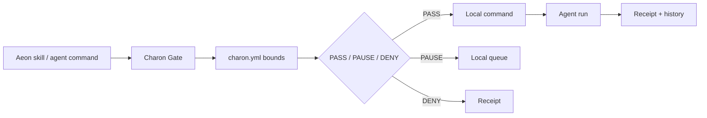

# Charon

Charon is a local policy gate and receipt layer for autonomous agents.

It lets agents work inside defined bounds. Every action gets a simple decision:

```txt
PASS  -> run after policy check
PAUSE -> wait for release review
DENY  -> refuse before execution
```

Charon v1 is local-first and Aeon-first. It sits before risky agent actions,
applies a programmable policy, scrubs blocked environment variables, writes
verifiable receipts, and keeps paused actions in a local queue.

## Why Charon Exists

Agent instructions are soft. Runtime bounds are harder.

Charon sits before an agent action, evaluates it against `charon.yml`, and only
lets passing actions execute.



## Install

Install Charon from this repo:

```bash
npm install
npm link
```

Check your machine:

```bash
charon doctor
```

## Quick Start

```bash
charon init
charon gate -- npm test
charon history latest
charon verify latest
```

Actions can pass, pause, or deny:

```bash
charon gate -- git push
charon queue
charon approve <id>
charon reject <id>
```

`charon run -- <command>` still works as a compatibility alias for
`charon gate -- <command>`.

## Aeon

Inside an Aeon repo:

```bash
charon aeon init
charon aeon enable
charon aeon run <skill>
```

For local testing without Claude:

```bash
charon aeon run <skill> -- echo "charon works"
```

Charon tags receipts with the Aeon skill name, policy hash, backend, command,
env exposure list, denied env list, timestamps, and exit code.

## Policy

`charon init` creates:

```yaml
version: 1
bounds:
  pass:
    - npm test
    - git diff
    - git status
    - echo
  pause:
    - git push
    - gh release create
    - deploy production
    - terraform apply
    - kubectl apply
  deny:
    - git push --force
    - npm publish
    - rm -rf
    - read:.env
    - read:~/.ssh/**
sandbox:
  backend: local
  files:
    read:
      - .
    write:
      - .charon/**
    deny:
      - .env
      - .env.*
      - ~/.ssh/**
      - ~/.aws/**
      - ~/.config/gh/**
  network:
    allow:
      - github.com
      - api.github.com
  commands:
    deny:
      - git push --force
      - npm publish
      - rm -rf
  env:
    expose: []
    deny:
      - ANTHROPIC_API_KEY
      - CLAUDE_CODE_OAUTH_TOKEN
      - GITHUB_TOKEN
      - GH_TOKEN
```

Compile without running:

```bash
charon compile
```

## Commands

```bash
charon init
charon doctor
charon compile
charon gate -- <command>
charon queue
charon approve <id>
charon reject <id>
charon history [list|latest|inspect <id|latest>]
charon status <id|latest>
charon verify latest
charon aeon init
charon aeon enable
charon aeon run <skill>
```

## Repository Structure

```txt
src/
  cli/
  core/
    gate/
    policy/
    queue/
    receipts/
    sandbox/
    security/
  integrations/
    aeon/
  utils/
```

## Scope

Charon v1 is intentionally narrow:

- macOS only
- Aeon first
- local action gate
- local queue and receipts
- no hosted service
- no token
- no marketplace

See [ROADMAP.md](./ROADMAP.md) for the build plan.
