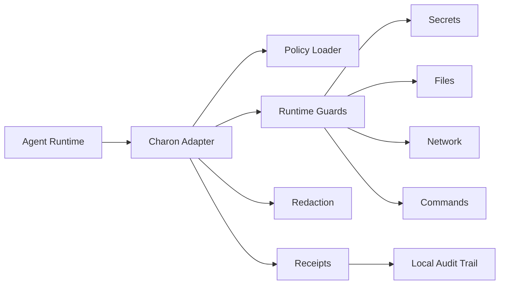

# Charon

Charon is a runtime boundary for autonomous agents.

It sits between an agent runtime and the things that runtime can touch:
secrets, files, shell commands, network destinations, prompts, tool results,
and irreversible actions.

The goal is simple: autonomous agents should be useful without receiving a
blank check to the machine they run on.

## Why Charon Exists

Agent runtimes are becoming more capable, but most of their safety controls
fall into one of three buckets:

| Runtime surface | What it usually handles | What Charon adds |
| --- | --- | --- |
| Tool allowlists | Which tools the model may call | Per-run policy around hosts, files, secrets, and commands |
| Static scanners | Suspicious skill/plugin content before execution | Runtime blocking when behavior crosses a red line |
| Approval flows | Human confirmation for some actions | Default-deny boundaries for unattended or background runs |
| Logs and traces | What happened after execution | Local receipts with allow/block decisions and redactions |

Charon does not replace the host runtime. It gives the runtime a stricter
execution boundary.

## Architecture

Charon is adapter-based. Each host runtime has a different execution model, so
Charon integrates at the point where that runtime actually dispatches work.



Core pieces:

- **Adapter:** connects Charon to a specific runtime.
- **Policy loader:** reads red lines and per-runtime settings.
- **Runtime guards:** block disallowed tool, shell, file, or network behavior.
- **Redaction:** removes secrets before they enter model context or tool output.
- **Receipts:** records local evidence of what was allowed, blocked, or redacted.
- **Passports:** summarizes what a skill or plugin can touch before it runs.

## Adapters

| Adapter | Integration style | Policy point |
| --- | --- | --- |
| [Aeon](./aeon) | GitHub Actions runner prelude | Before scheduled Aeon skills invoke Claude |
| [Hermes](./hermes) | Native Hermes plugin hooks | Before Hermes tool calls execute |

### Aeon

Aeon is built for scheduled autonomous skills. Charon installs once into an
Aeon fork and patches the workflow path before Claude runs.

Charon adds runtime enforcement around:

- denied secret exposure
- prompt redaction
- network host allowlists
- common file-read red lines
- irreversible shell commands
- per-run receipts
- skill passports

### Hermes

Hermes has a long-running agent loop and a plugin system. Charon runs as a
native Hermes plugin and uses Hermes hooks such as `pre_tool_call`,
`post_tool_call`, and `transform_tool_result`.

Charon adds runtime enforcement around:

- terminal egress
- secret exfiltration commands
- red-line file reads
- irreversible terminal commands
- tool-result redaction
- per-tool receipts

## Policy Model

Charon policies are built around red lines: things an autonomous run should
not cross unless the operator explicitly changes policy.

Example:

```yaml
red_lines:
  never_expose:
    - GITHUB_TOKEN
    - ANTHROPIC_API_KEY
  never_read:
    - .env
    - ~/.ssh/**
  never_call:
    - pastebin.com
    - webhook.site
  irreversible:
    commands:
      - git push
      - npm publish
      - rm -rf
```

## Quick Start

Aeon:

```bash
cd charon/aeon
npm install
npm run smoke
npm test
```

In an Aeon fork:

```bash
npx charon setup --commit
npx charon passport
```

After pulling Aeon upstream updates:

```bash
npx charon sync --commit
```

After an Aeon run:

```bash
npx charon receipts list
npx charon receipts latest
```

Hermes:

```bash
python3 -m unittest discover -s charon/hermes/tests -p 'test_*.py'
python3 charon/hermes/install.py
```

## Current Scope

Charon is intentionally local-first.

It does not require a hosted service, token, marketplace, or payment layer.
Receipts and policies stay on the machine or repository where the runtime is
executing.

The current adapters provide practical guardrails, not a complete operating
system sandbox. Stronger sandbox backends can be layered underneath Charon as
the adapters mature.
