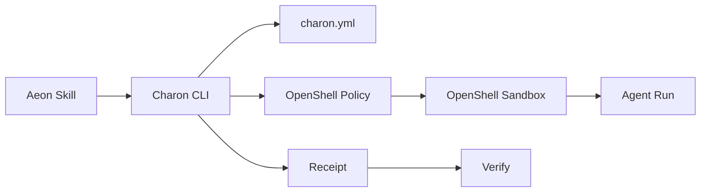

# Charon

Charon is a macOS security runtime for autonomous agents.

It gives Aeon runs a real sandbox boundary through OpenShell, so agents can do
useful work without getting a blank check to the developer machine.

## Why Charon Exists

Agent frameworks usually rely on prompts, tool allowlists, approval flows, or
static scanners. Those help, but they are not the same thing as runtime
isolation.

Charon turns a simple policy into a sandboxed agent run:

```txt
charon.yml -> Charon compiler -> OpenShell sandbox -> agent command
```

## Architecture



| Layer | Responsibility |
| --- | --- |
| Charon policy | Builder-friendly file, network, command, and env rules |
| Charon compiler | Converts `charon.yml` into OpenShell runtime config |
| OpenShell | Real sandbox backend |
| Receipts | Local proof of which policy/backend wrapped a run |
| Aeon adapter | Skill-aware defaults and receipts |

## Install

Charon v1 is macOS-only and uses OpenShell.

Install OpenShell:

```bash
curl -LsSf https://raw.githubusercontent.com/NVIDIA/OpenShell/main/install.sh | sh
brew install e2fsprogs
```

Install Charon from this repo:

```bash
npm install
npm link
```

Check your machine:

```bash
charon doctor
```

If OpenShell is using the macOS VM driver, `e2fsprogs` provides `mkfs.ext4`
for first-run root filesystem creation.

## Quick Start

Create a policy:

```bash
charon init
```

Run any command through Charon:

```bash
charon run -- npm test
```

Inspect the latest run:

```bash
charon receipts latest
charon verify latest
```

## Aeon

Inside an Aeon repo:

```bash
charon aeon init
charon aeon run <skill>
```

For local testing without Claude:

```bash
charon aeon run <skill> -- echo "sandbox works"
```

Charon tags receipts with the Aeon skill name, policy hash, backend, command,
env exposure list, denied env list, timestamps, and exit code.

## Policy

`charon init` creates:

```yaml
version: 1
sandbox:
  backend: openshell
  files:
    read:
      - .
    write:
      - .charon/**
    deny:
      - .env
      - .env.*
      - ~/.ssh/**
      - ~/.aws/**
      - ~/.config/gh/**
  network:
    allow:
      - github.com
      - api.github.com
  commands:
    deny:
      - git push
      - npm publish
      - rm -rf
  env:
    expose: []
    deny:
      - ANTHROPIC_API_KEY
      - CLAUDE_CODE_OAUTH_TOKEN
      - GITHUB_TOKEN
      - GH_TOKEN
```

Compile without running:

```bash
charon compile
```

## Commands

```bash
charon init
charon doctor
charon compile
charon run -- <command>
charon aeon init
charon aeon run <skill>
charon receipts
charon verify latest
```

## Scope

Charon v1 is intentionally narrow:

- macOS only
- Aeon first
- OpenShell backend
- local receipts
- no hosted service
- no token
- no marketplace

See [ROADMAP.md](./ROADMAP.md) for the build plan.
