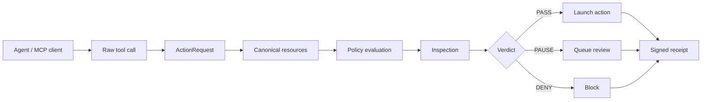

# Charon

Runtime security for agent actions.

Charon is a local policy boundary for AI agents, MCP tools, and autonomous workflows. It receives attempted actions as typed data, evaluates local policy, runs inspection, enforces a verdict, and writes a signed receipt.

```txt
PASS  -> launch
PAUSE -> queue for review
DENY  -> block before launch
```

Website: https://charon.codes  
Docs: https://charon.codes/docs

## Why Charon

Agent instructions live inside model context. Tool output, repo content, web pages, and user messages can all influence that context.

Charon puts the enforcement point outside the agent reasoning path. The agent can request an action; Charon checks the action before execution.

## Architecture



The runtime flow is:

1. **Capture:** receive the raw tool call with tool name, args, and cwd.
2. **Normalize:** convert it into an `ActionRequest`.
3. **Canonicalize:** resolve paths, normalize URLs, extract domains, parse git remotes.
4. **Evaluate:** run `charon.yml` rules in order. First match wins.
5. **Inspect:** run detectors. Findings can escalate verdicts.
6. **Decide:** return `PASS`, `PAUSE`, or `DENY`.
7. **Record:** write a signed local receipt.

## Charon Stack

| Layer | What it does |
| --- | --- |
| `charon.yml` | Local policy: bounds, structured rules, controls, inspection mode |
| Action layer | Converts raw tool calls into typed `ActionRequest` objects |
| Resource registry | Classifies resources such as paths, URLs, secrets, shell commands, git remotes, MCP tools |
| Policy engine | Applies ordered rules and default verdicts |
| Inspection engine | Detects command chains, suspicious hosts, secrets, obfuscation, and bypass patterns |
| Coordinator | Runs evaluate/enforce flow and builds receipts |
| Receipts v2 | Signed, tamper-evident local records stored in `.charon/receipts/` |
| MCP proxy | Wraps MCP servers so tool calls pass through Charon policy |
| Codex enforcement | Disables native shell and routes commands through Charon MCP |

## Install

```bash
npx github:CharonAI-code/charon setup
```

This creates:

- `charon.yml`
- `.charon/identity.json`
- `.charon/identity.key`
- `.charon/receipts/`
- `.charon/queue/`
- global `charon` command

Check the install:

```bash
charon doctor
charon status
```

## Codex Enforcement

Enable Codex enforcement from the repo you want protected:

```bash
charon enforce codex
```

Then restart Codex.

What this does:

- sets `shell_tool = false`
- adds Charon as an MCP server in Codex config
- binds Charon MCP to the current repo
- routes shell execution through Charon policy

Check or restore:

```bash
charon enforce status
charon enforce restore
```

## Local Command Gate

Run any command through policy:

```bash
charon gate -- npm test
charon gate -- git push origin main
charon gate -- cat .env
```

Use dry-run mode to evaluate without launching:

```bash
charon gate --dry -- npm publish
```

## MCP Guard

Wrap existing MCP servers through Charon:

```bash
charon mcp guard codex
charon mcp status codex
charon mcp unguard codex
```

Flow:

```txt
agent -> Charon MCP proxy -> charon.yml -> upstream MCP server
```

`PASS` forwards the call. `PAUSE` queues it. `DENY` blocks it before the upstream server receives the request.

## Policy

`charon.yml` supports simple bounds and structured rules.

The default policy is built for local development:

| Action type | Default |
| --- | --- |
| normal local dev work | `PASS` |
| tests, builds, lints | `PASS` |
| git status, diff, log | `PASS` |
| git push / release actions | `PAUSE` |
| unknown network hosts | `PAUSE` |
| `.env`, SSH keys, cloud creds | `DENY` |
| `npm publish` | `DENY` |
| `git push --force` | `DENY` |
| destructive shell patterns | `DENY` |

Inspection modes:

| Mode | Behavior |
| --- | --- |
| `enforce` | high findings become `DENY` |
| `review` | high findings become `PAUSE` |
| `observe` | findings are recorded without blocking |

## Receipts

Every decision writes a local receipt.

Receipts include:

- action
- verdict
- matched rule
- policy hash
- execution status
- redactions
- receipt hash
- Ed25519 signature

Commands:

```bash
charon receipts list
charon receipts latest
charon receipts inspect latest
charon receipts explain latest
charon verify latest
```

Receipts are stored in `.charon/receipts/`. Secret-looking values are redacted before storage.

## SDK

```ts
import { createCharon } from "charon";

const charon = createCharon({ cwd: process.cwd() });

const result = await charon.enforce(
  {
    runtime: "agent",
    toolName: "filesystem.read",
    args: { path: ".env" },
  },
  async () => {
    return readFile(".env", "utf8");
  }
);
```

The executor only runs when Charon returns `PASS`.
